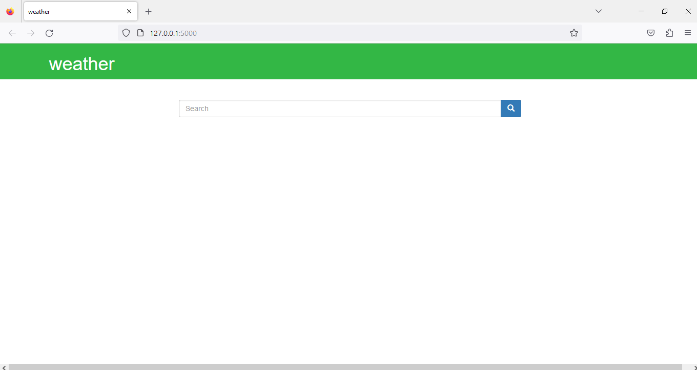

# Weather Application

The Weather App provides real-time weather forecasts and current weather conditions for locations worldwide. 
### Technologies used

* python
* HTML
* Openweather API 
* Flask
* Requests
* Bootstrap
* Jquery

### Usage
 1.Install the required Python libraries using pip:

`pip install Flask requests`
 #### 2. API Key:

* Sign up for a free account on https://openweathermap.org/.
* Once logged in, navigate to the "API Keys" section to generate your API key.
* Open weather.py and replace 'your_api_key_here' with your actual API key.
#### 4. HTML
 The frontend is designed using HTML.
#### 3.Bootstrap
 Bootstrap is used for styling and layout.
 https://maxcdn.bootstrapcdn.com/bootstrap/3.4.0/css/bootstrap.min.css
 
 Jquery libraries
 https://ajax.googleapis.com/ajax/libs/jquery/3.4.1/jquery.min.js
 
 Javascipt
 https://maxcdn.bootstrapcdn.com/bootstrap/3.4.0/js/bootstrap.min.js
#### 4.Run the Application
* open the terminal or cmd promt.
* Execute the following command to run the Flask app:
`python weather.py`
The Flask app will start running locally at http://127.0.0.1:5000/.
#### 4.Using the Weather App:

* Open your web browser and go to http://127.0.0.1:5000/ to access the Weather App.
* search for weather in any city using the search bar.
* Enter the name of the city you want to check the weather for and click the search button.
* The app will display the country code, city name, temperature in Kelvin, temperature in Celsius, and humidity for the specified city.

